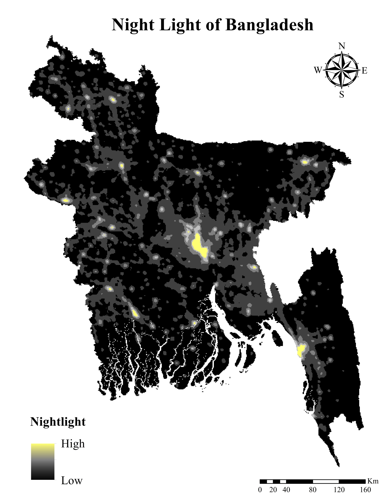

=# Google Earth Engine (GEE) Spatial Analysis Projects

This repository provides Google Earth Engine JavaScript scripts and resulting map products for Bangladesh and the Dhaka metropolitan area.

---

### 1. Urban Heat Island (UHI) Analysis (2022)

* **Script:** [`scripts/UHI.js`](scripts/UHI.js)
* **Description:** Computes Normalized Urban Heat Island using Landsat 8 Level 2 Surface Temperature and Fractional Vegetation Cover.

---

### 2. RUSLE Soil Loss Model (2021–2022)

* **Script:** [`scripts/soil_loss.js`](scripts/soil_loss.js)
* **Description:** Evaluates annual soil loss (t/hac/year) using CHIRPS rainfall, OpenLandMap soil texture, SRTM elevation, Sentinel-2 NDVI, and MODIS LULC.

---

### 3. NDVI Map of Bangladesh (2022)

* **Script:** [`scripts/NDVI.js`](scripts/NDVI.js)
* **Description:** Cloud-masked Landsat 8 composite displaying the Normalized Difference Vegetation Index.

---

### 4. DMSP-OLS Nighttime Light Analysis

* **Script:** [`scripts/Nightlight.js`](scripts/Nightlight.js)
* **Description:** Historical stable lights median composite clipped to the national boundary.

